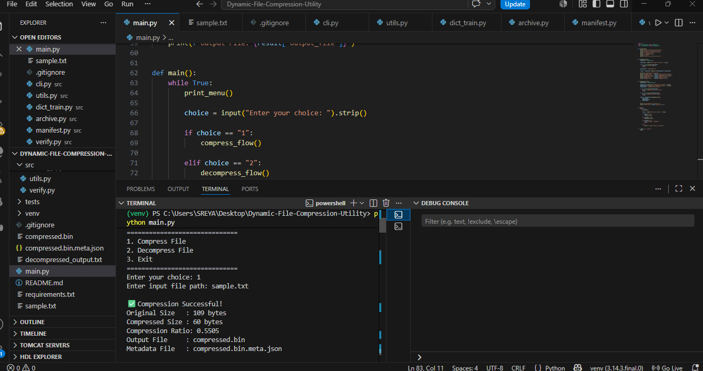
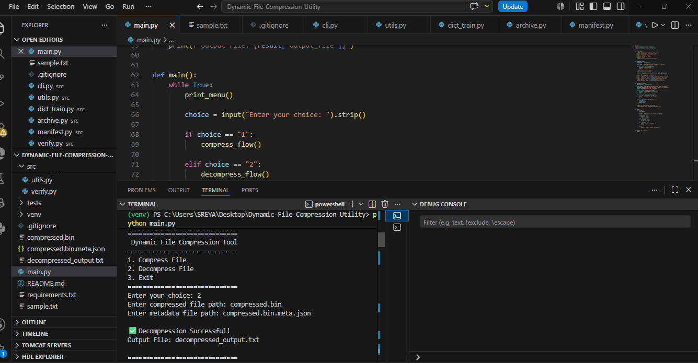
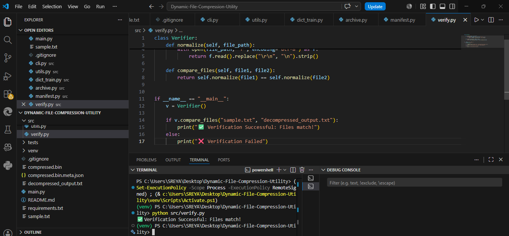

# 📦 Dynamic File Compression Utility (Huffman Coding)

## 🚀 Project Overview
This project is a **Dynamic File Compression and Decompression Utility** built using **Python** and **Huffman Coding Algorithm**.  
It demonstrates how lossless compression works using **Data Structures and Algorithms (DSA)** concepts.

The system compresses files using frequency-based encoding and restores them back without any data loss.


## 🎯 Objective
To build a DSA-based system that:
- Compresses files efficiently using Huffman Coding
- Decompresses files back to original form
- Verifies integrity of data after compression
- Demonstrates real-world application of greedy algorithms and binary trees

## 🧠 DSA Concepts Used
- Greedy Algorithm (Huffman Coding)
- Binary Tree Construction
- Priority Queue / Min Heap Logic
- HashMap (Frequency Table)
- Recursion (Tree Traversal)
- File Handling (Binary + Text)


## ⚙️ Features
- 📂 File Compression using Huffman Encoding
- 🔓 File Decompression (Lossless Recovery)
- ✅ File Integrity Verification (SHA / text comparison)
- 📊 Frequency Table Generation
- 🧾 Metadata storage (.meta.json)
- 💻 CLI-based interface


## 📁 Project Structure


Dynamic-File-Compression-Utility/
│
├── src/
│ ├── compressor.py
│ ├── decompressor.py
│ ├── verify.py
│ ├── huffman.py
│
├── sample.txt
├── compressed.bin
├── compressed.bin.meta.json
├── decompressed_output.txt
│
├── main.py
└── README.md


## ▶️ How to Run the Project

### 1. Clone the repository
```bash
git clone https://github.com/your-username/dynamic-file-compression-utility.git
cd dynamic-file-compression-utility
2. Run the program
python main.py
3. Menu Options
1 → Compress File
2 → Decompress File
3 → Exit
4. Run Verification (Optional)
python src/verify.py
📊 Sample Output
Compression Successful!
Output File: compressed.bin

Decompression Successful!
Output File: decompressed_output.txt

✅ Verification Successful: Files match!
📈 Example Workflow
Input File → Frequency Table → Huffman Tree → Encoding →
Compressed File → Decoding → Original File Restored
🔍 Key Learning Outcomes
Understanding Huffman Coding deeply
Implementing real-world compression system
Working with binary data and file handling
Applying DSA in practical applications
System design thinking for storage optimization

## 📷 Screenshots

### Compression Output


### Decompression Output


### Verification Success


🧪 Verification System

The project includes a verification module that ensures:

Original file == Decompressed file
Guarantees lossless compression
📌 Future Improvements
GUI interface using Tkinter
Folder compression support
Faster parallel compression
Encryption + compression combo
Drag and drop interface
👨‍💻 Author
SREYA PAL
